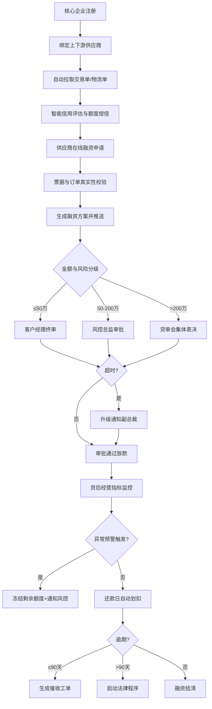

## 1. 产品概述

大型供应链金融管理平台，为核心企业及其上下游供应商提供一站式融资服务。通过整合交易数据、物流数据与企业画像，实现智能信用评估、自动化审批、贷后监控预警的全链路数字化管理。

- **目标用户**：核心企业财务/供应链管理者、上下游供应商、客户经理、风控总监、贷审会成员、系统管理员
- **核心价值**：解决中小企业融资难问题，降低金融机构风控成本，提升供应链整体运转效率

## 2. 核心功能

### 2.1 用户角色

| 角色 | 注册方式 | 核心权限 |
|------|----------|----------|
| 核心企业 | 企业信息注册+资质审核 | 绑定供应商、查看交易数据、融资担保 |
| 供应商 | 核心企业邀请链接注册 | 融资申请、票据上传、查看额度、还款管理 |
| 客户经理 | 内部账号分配 | 融资申请受理、50万以下终审、客户维护 |
| 风控总监 | 内部账号分配 | 50-200万审批、风险策略配置、预警处理 |
| 贷审会成员 | 内部账号分配 | 200万以上集体表决、重大风险决策 |
| 系统管理员 | 超级管理员创建 | 用户管理、看板查看、报表导出、系统配置 |

### 2.2 功能模块

1. **企业注册与认证**：核心企业信息提交、资质审核、供应商绑定管理
2. **数据集成中心**：交易单自动拉取、物流单对接、票据OCR识别
3. **信用评估引擎**：多维度评分卡、额度测算模型、风险等级划分
4. **融资申请中心**：在线申请、票据校验、融资方案自动生成
5. **多级审批工作流**：动态路由审批、超时升级机制、电子签章
6. **贷后监控系统**：经营指标实时监控、异常预警、额度冻结
7. **还款与催收**：自动划扣、逾期提醒、催收工单、法律程序触发
8. **管理决策看板**：在贷余额、授信使用率、逾期率、行业风险分布
9. **风险预判系统**：宏观数据分析、行业趋势预测、授信策略建议
10. **报表中心**：月度运营报表、数据导出、自定义报表

### 2.3 页面详情

| 页面名称 | 模块名称 | 功能描述 |
|----------|----------|----------|
| 登录页 | 角色选择登录 | 多角色登录入口、账号密码/短信验证、忘记密码 |
| 核心企业工作台 | 企业信息、供应商列表、交易总览 | 企业资质管理、供应商绑定/解绑、交易数据统计 |
| 供应商工作台 | 额度总览、融资申请、还款计划 | 可用额度展示、融资发起、待还款提醒 |
| 信用评估页 | 评分详情、额度建议、历史趋势 | 多维度评分展示、额度模型因子、评分变化曲线 |
| 融资申请页 | 信息填写、票据上传、方案预览 | 融资金额/期限选择、发票/订单上传、多方案对比 |
| 审批工作台 | 待办列表、审批详情、审批记录 | 动态分配待办、审批意见、流程节点追踪 |
| 贷后监控页 | 指标监控、预警列表、额度管理 | 订单量/退货率/回款周期监控、预警处理、额度冻结/解冻 |
| 还款管理页 | 还款计划、代扣记录、逾期管理 | 分期计划、自动划扣状态、逾期工单 |
| 管理看板 | 数据大屏、风险地图、趋势分析 | 核心指标KPI、行业分布热力图、逾期率趋势 |
| 报表中心 | 月度报表、自定义报表、导出 | 融资额/利息/不良率/审批时效统计、Excel导出 |

## 3. 核心流程

### 3.1 融资审批主流程

核心企业注册并绑定供应商 → 系统拉取交易/物流数据 → 智能评估信用额度 → 供应商提交融资申请 → 系统校验票据真实性 → 生成融资方案推送 → 按金额/风险等级动态路由审批 → 超时升级通知副总裁 → 放款 → 贷后指标监控 → 异常预警冻结额度 → 还款日自动划扣 → 逾期催收 → 90天以上启动法律程序

## 4. 用户界面设计

### 4.1 设计风格

- **主色调**：深蓝 #0B2545（专业金融）、金色 #D4AF37（财富尊贵）
- **辅助色**：青色 #1B9AAA（数据科技感）、警告红 #C1292E、成功绿 #2E8B57
- **按钮风格**：圆角 6px、微渐变填充、悬浮阴影加深
- **字体**：标题 Noto Serif SC（宋体衬线体现专业感）、正文 Noto Sans SC
- **布局风格**：左侧导航栏 + 顶部用户栏 + 主体卡片式区域、数据大屏采用深色背景
- **视觉元素**：细金线分隔、微噪点背景、数据发光效果、图表渐变填充

### 4.2 页面设计概览

| 页面名称 | 模块名称 | UI元素 |
|----------|----------|--------|
| 登录页 | 登录卡片 | 深色背景+金色装饰线、公司Logo居中、表单卡片浮起阴影 |
| 管理看板 | 数据大屏 | 深色背景、KPI卡片发光边框、行业地图热力图、实时数据滚动 |
| 审批工作台 | 待办列表 | 卡片列表+紧急程度色块标记、审批进度时间轴、侧边详情抽屉 |
| 信用评估页 | 评分仪表盘 | 环形进度条仪表盘、因子雷达图、历史评分折线图 |
| 融资申请页 | 多步骤表单 | 步骤条导航、票据上传拖拽区、方案对比卡片 |

### 4.3 响应式

- 桌面端优先（1440px 基准）
- 平板端（768px）：侧边栏折叠为图标
- 移动端（375px）：底部Tab导航、卡片单列堆叠

## 5. 非功能需求

- **性能**：看板首屏加载 < 2s，审批列表滚动 60fps
- **安全**：票据传输加密、敏感数据脱敏显示、操作审计日志
- **可用性**：审批超时自动提醒、异常预警多渠道通知（站内信/短信/邮件）
