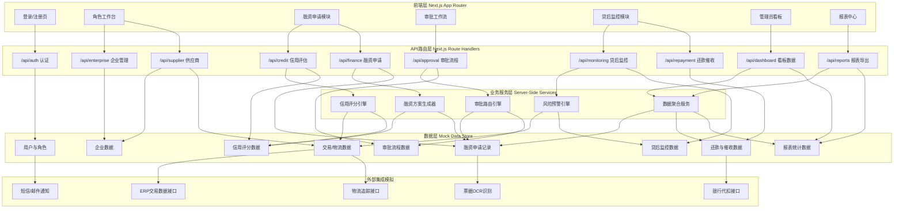
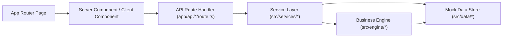
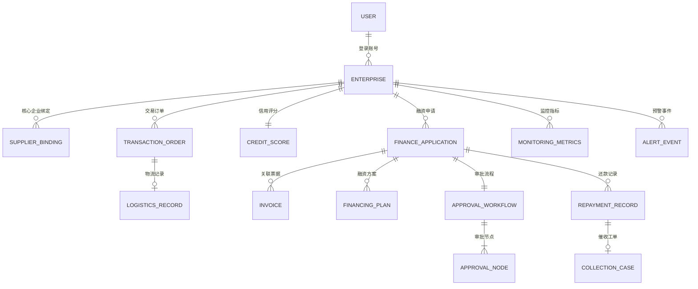

## 1. 架构设计



## 2. 技术描述

- **前端框架**：Next.js 14 (App Router) + React 18 + TypeScript
- **样式方案**：TailwindCSS 3 + shadcn/ui 组件库 + 自定义主题变量
- **图表可视化**：Recharts（折线/柱状/饼图）+ 简单热力图组件
- **状态管理**：React Context（角色/权限）+ URL SearchParams（筛选状态）
- **数据持久化**：localStorage + 内存 Mock 数据仓库（带模拟延迟）
- **表单处理**：React Hook Form + Zod 校验
- **文件导出**：xlsx (SheetJS) 生成 Excel 报表
- **UI 图标**：Lucide React
- **初始化工具**：手动搭建 Next.js 项目结构

## 3. 路由定义

| 路由 | 用途 | 访问角色 |
|------|------|----------|
| /login | 多角色登录入口 | 公开 |
| /register/core | 核心企业注册 | 公开 |
| /dashboard | 管理员数据看板大屏 | 管理员 |
| /enterprise/workbench | 核心企业工作台 | 核心企业 |
| /enterprise/suppliers | 供应商绑定管理 | 核心企业 |
| /supplier/workbench | 供应商工作台 | 供应商 |
| /supplier/credit | 信用评估详情 | 供应商/核心企业 |
| /finance/apply | 融资申请提交 | 供应商 |
| /finance/list | 融资申请列表 | 所有内部角色 |
| /approval/workbench | 审批工作台待办 | 客户经理/风控/贷审会 |
| /approval/detail/:id | 审批详情页 | 对应审批角色 |
| /monitoring/dashboard | 贷后监控看板 | 风控/管理员 |
| /monitoring/alerts | 预警处理列表 | 风控/管理员 |
| /repayment/plan | 还款计划与代扣 | 供应商/财务 |
| /repayment/collection | 逾期催收工单 | 风控/催收 |
| /reports/monthly | 月度运营报表 | 管理员/高管 |
| /reports/export | 自定义报表导出 | 管理员 |

## 4. API 定义 (TypeScript Schema)

```typescript
// 角色枚举
type UserRole = 'core_enterprise' | 'supplier' | 'relationship_manager' | 'risk_director' | 'credit_committee' | 'admin'

// 风险等级
type RiskLevel = 'low' | 'medium' | 'high' | 'critical'

// 审批状态
type ApprovalStatus = 'pending' | 'approved' | 'rejected' | 'escalated' | 'timeout'

// 融资状态
type FinanceStatus = 'draft' | 'submitted' | 'verifying' | 'approved' | 'rejected' | 'disbursed' | 'repaid' | 'overdue' | 'write_off'

// 预警类型
type AlertType = 'order_drop' | 'return_spike' | 'payment_delay' | 'abnormal_behavior'

interface Enterprise {
  id: string
  name: string
  unifiedCreditCode: string
  legalPerson: string
  registeredCapital: number
  industry: string
  contactInfo: { phone: string; email: string }
  certificationStatus: 'pending' | 'verified' | 'rejected'
  role: UserRole
  createdAt: string
}

interface SupplierBinding {
  id: string
  coreEnterpriseId: string
  supplierId: string
  cooperationSince: string
  annualTransactionVolume: number
  status: 'active' | 'suspended' | 'terminated'
}

interface TransactionOrder {
  id: string
  orderNo: string
  coreEnterpriseId: string
  supplierId: string
  amount: number
  productName: string
  quantity: number
  orderDate: string
  deliveryDate: string
  status: 'created' | 'shipped' | 'delivered' | 'completed' | 'returned'
  logisticsTracking?: LogisticsRecord
}

interface LogisticsRecord {
  id: string
  trackingNo: string
  carrier: string
  status: 'picked' | 'in_transit' | 'delivered'
  estimatedArrival: string
  actualArrival?: string
  checkpoints: Array<{ time: string; location: string; description: string }>
}

interface CreditScore {
  id: string
  supplierId: string
  overallScore: number // 0-100
  riskLevel: RiskLevel
  creditLimit: number
  availableLimit: number
  factors: {
    transactionHistory: number
    financialHealth: number
    operationStability: number
    industryEnvironment: number
    compliance: number
  }
  evaluationDate: string
  trend: 'up' | 'stable' | 'down'
}

interface FinanceApplication {
  id: string
  applicationNo: string
  supplierId: string
  coreEnterpriseId: string
  amount: number
  termDays: number
  purpose: string
  attachedInvoices: Invoice[]
  attachedOrders: string[]
  riskLevel: RiskLevel
  status: FinanceStatus
  verificationResult?: {
    authenticity: boolean
    confidence: number
    notes: string
  }
  financingPlans?: FinancingPlan[]
  currentApprovalNode?: number
  approvalWorkflowId?: string
  createdAt: string
  submittedAt?: string
  approvedAt?: string
  disbursedAt?: string
}

interface Invoice {
  id: string
  invoiceNo: string
  amount: number
  invoiceDate: string
  buyer: string
  seller: string
  verified: boolean
  verificationScore: number
}

interface FinancingPlan {
  id: string
  name: string
  principal: number
  annualRate: number
  termDays: number
  totalInterest: number
  monthlyPayment: number
  repaymentMethod: 'bullet' | 'equal_installment' | 'interest_only'
}

interface ApprovalWorkflow {
  id: string
  financeApplicationId: string
  amount: number
  riskLevel: RiskLevel
  nodes: ApprovalNode[]
  currentNodeIndex: number
  status: ApprovalStatus
  escalated: boolean
  createdAt: string
  completedAt?: string
}

interface ApprovalNode {
  index: number
  name: string
  requiredRole: UserRole
  timeoutHours: number
  assigneeId?: string
  status: 'pending' | 'in_progress' | 'approved' | 'rejected' | 'skipped'
  decision?: 'approve' | 'reject' | 'escalate'
  comment?: string
  decidedAt?: string
  deadline?: string
}

interface MonitoringMetrics {
  id: string
  supplierId: string
  date: string
  orderVolume: number
  orderVolumeMom: number // 环比
  returnRate: number
  returnRateMom: number
  paymentCycleDays: number
  paymentCycleMom: number
  activeFinancingCount: number
  totalOutstanding: number
}

interface AlertEvent {
  id: string
  supplierId: string
  type: AlertType
  level: RiskLevel
  title: string
  description: string
  metricValue: number
  threshold: number
  triggeredAt: string
  status: 'new' | 'processing' | 'resolved' | 'false_alarm'
  frozenCreditLimit?: number
  handledBy?: string
  handledAt?: string
  handlingNotes?: string
}

interface RepaymentRecord {
  id: string
  financeApplicationId: string
  periodNo: number
  dueDate: string
  principal: number
  interest: number
  totalAmount: number
  status: 'pending' | 'auto_deducting' | 'paid' | 'overdue' | 'partial'
  actualPaidAt?: string
  actualPaidAmount?: number
  collectionCaseId?: string
}

interface CollectionCase {
  id: string
  caseNo: string
  financeApplicationId: string
  supplierId: string
  overdueDays: number
  overdueAmount: number
  status: 'new' | 'contacted' | 'promise_to_pay' | 'escalated' | 'legal_proceeding' | 'closed' | 'written_off'
  assignedTo?: string
  followUpRecords: Array<{ time: string; operator: string; content: string }>
  createdAt: string
}

interface MonthlyReport {
  month: string
  totalFinancingAmount: number
  totalFinancingCount: number
  totalInterestIncome: number
  averageApprovalHours: number
  overdueRate: number
  nonPerformingRate: number
  enterpriseBreakdown: Array<{
    enterpriseName: string
    financingAmount: number
    interestIncome: number
    nonPerformingRate: number
  }>
  industryBreakdown: Array<{
    industry: string
    financingAmount: number
    overdueRate: number
  }>
}
```

## 5. 服务端架构 (Next.js Route Handler)



- **Controller 层**：Next.js Route Handlers，负责请求解析、鉴权、响应格式化
- **Service 层**：业务逻辑封装，如 CreditService、ApprovalService、MonitoringService
- **Engine 层**：核心算法引擎，信用评分引擎、审批路由引擎、风险预警引擎
- **Data 层**：Mock 数据仓库，含初始种子数据、CRUD 操作、模拟延迟

## 6. 数据模型

### 6.1 ER 图



### 6.2 目录结构

```
.
├── app/
│   ├── api/                    # API 路由
│   │   ├── auth/
│   │   ├── enterprise/
│   │   ├── supplier/
│   │   ├── credit/
│   │   ├── finance/
│   │   ├── approval/
│   │   ├── monitoring/
│   │   ├── repayment/
│   │   ├── reports/
│   │   └── dashboard/
│   ├── login/
│   ├── register/
│   ├── dashboard/
│   ├── enterprise/
│   ├── supplier/
│   ├── finance/
│   ├── approval/
│   ├── monitoring/
│   ├── repayment/
│   ├── reports/
│   ├── layout.tsx
│   ├── page.tsx
│   └── globals.css
├── src/
│   ├── components/             # UI 组件
│   │   ├── layout/            # 布局组件 (Sidebar, Topbar)
│   │   ├── charts/            # 图表组件
│   │   ├── finance/           # 融资相关组件
│   │   ├── approval/          # 审批相关组件
│   │   ├── monitoring/        # 监控相关组件
│   │   └── ui/                # shadcn 基础组件
│   ├── services/              # 业务服务层
│   ├── engine/                # 核心算法引擎
│   ├── data/                  # Mock 数据层
│   ├── lib/                   # 工具函数
│   ├── context/               # React Context
│   ├── hooks/                 # 自定义 Hooks
│   └── types/                 # 类型定义
├── public/
├── package.json
├── tsconfig.json
├── tailwind.config.ts
├── next.config.mjs
└── postcss.config.mjs
```
